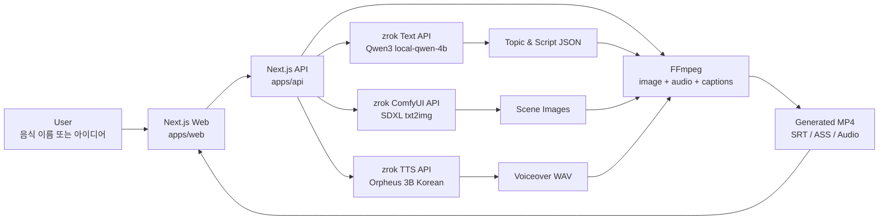

# 골때리는 건강 가이드 스튜디오

음식 이름이나 짧은 아이디어를 입력하면 AI가 숏츠 주제, 대본, 이미지, TTS 음성, 자막, MP4 영상을 한 번에 생성하는 풀스택 AI 콘텐츠 제작 도구입니다.

[](https://nextjs.org/)
[](https://www.typescriptlang.org/)
[](https://vercel.com/)
[](https://github.com/comfyanonymous/ComfyUI)
[](https://ffmpeg.org/)

## Overview

이 프로젝트는 음식 캐릭터 밈과 건강 정보를 결합해 짧은 영상 콘텐츠를 빠르게 제작하기 위한 MVP입니다.

- 음식/아이디어 기반 숏츠 주제 후보 5개 생성
- 선택한 주제 기반 4씬 대본 생성
- ComfyUI SDXL 기반 씬별 이미지 생성
- Orpheus 한국어 TTS 기반 음성 생성
- 자막 파일 생성 및 FFmpeg MP4 합성
- 프론트엔드와 백엔드를 분리한 Next.js 모노레포 구조
- zrok으로 공개된 로컬 AI 모델 서버와 Vercel 배포 API 연동

## Demo

- Web: [https://golddaegeon-health-guide-studio-web.vercel.app](https://golddaegeon-health-guide-studio-web.vercel.app)
- API Health: [https://golddaegeon-health-guide-studio-api.vercel.app/api/health](https://golddaegeon-health-guide-studio-api.vercel.app/api/health)
- Repository: [https://github.com/iris112-sung/golddaegeon-health-guide-studio](https://github.com/iris112-sung/golddaegeon-health-guide-studio)

## Tech Stack

| Layer | Stack |
| --- | --- |
| Frontend | Next.js App Router, React 19, TypeScript, Tailwind CSS, lucide-react |
| Backend | Next.js Route Handlers, TypeScript, Zod |
| Text AI | zrok 공개 Qwen3 4B 계열 로컬 LLM API |
| Image AI | zrok 공개 ComfyUI API, SDXL checkpoint |
| TTS AI | zrok 공개 Orpheus 3B Korean TTS API |
| Video | FFmpeg, ASS/SRT captions |
| Deploy | Vercel Web, Vercel API, GitHub |

## Architecture



## Workflow

1. 사용자가 음식 이름 또는 아이디어를 입력합니다.
2. API가 zrok 텍스트 모델에 주제 후보 생성을 요청합니다.
3. 선택된 주제로 숏츠 대본과 씬 구성을 생성합니다.
4. 각 씬의 `imagePrompt`를 ComfyUI `/prompt`에 등록합니다.
5. `/history/{prompt_id}`를 polling하고 `/view`로 이미지를 가져옵니다.
6. 씬 대사를 Orpheus TTS `/tts`에 전달하고 `/audio/{filename}.wav`를 가져옵니다.
7. FFmpeg가 이미지, 오디오, 자막을 합성해 MP4를 생성합니다.

## Project Structure

```text
.
├── apps
│   ├── api
│   │   └── src
│   │       ├── app/api
│   │       └── lib/ai
│   └── web
│       └── src
│           ├── app
│           └── lib
├── packages
│   └── shared
└── README.md
```

## Environment

백엔드 환경변수는 `apps/api/.env.local`에 둡니다.

```env
OPENAI_API_KEY=

TEXT_AI_PROVIDER=zrok
ZROK_AI_BASE_URL=https://ym1mvbhf9e0w.shares.zrok.io
ZROK_TEXT_MODEL=local-qwen-4b
ZROK_REQUEST_TIMEOUT_MS=30000

IMAGE_PROVIDER=local
LOCAL_IMAGE_API=legacy
LOCAL_IMAGE_BASE_URL=https://8cauqh4loyzr.shares.zrok.io
LOCAL_IMAGE_MODEL=FLUX.2 Klein 4B mflux 4bit
LOCAL_IMAGE_SIZE=512x512
LOCAL_IMAGE_SEED=42
LOCAL_IMAGE_CFG_SCALE=7.5
LOCAL_IMAGE_STEPS=4
LOCAL_IMAGE_SAMPLER=euler
LOCAL_IMAGE_SCHEDULER=normal
LOCAL_IMAGE_TIMEOUT_MS=180000
IMAGE_CONCURRENCY=1

TTS_PROVIDER=local
LOCAL_TTS_BASE_URL=https://w3mzn1l1ted0.shares.zrok.io
LOCAL_TTS_VOICE=유나
LOCAL_TTS_LANGUAGE=ko-KR
LOCAL_TTS_RATE=1
LOCAL_TTS_VOLUME=100
LOCAL_TTS_TIMEOUT_MS=50000
TTS_CONCURRENCY=1

VIDEO_SEGMENT_CONCURRENCY=2
VIDEO_WIDTH=720
VIDEO_HEIGHT=1280
VIDEO_FPS=24
USE_MOCK_AI=false
WEB_ORIGIN=http://localhost:3000
```

프론트엔드 환경변수는 `apps/web/.env.local`에 둡니다.

```env
NEXT_PUBLIC_API_BASE_URL=http://localhost:3001
```

## How to Run

```bash
npm install
npm run dev
```

- Web: `http://localhost:3000`
- API: `http://localhost:3001`

배포 환경에서는 Web과 API가 각각 Vercel 프로젝트로 분리되어 있으며, Web은 `NEXT_PUBLIC_API_BASE_URL`로 배포 API를 바라봅니다.

## API

| Method | Endpoint | Description |
| --- | --- | --- |
| `GET` | `/api/health` | API 상태 확인 |
| `POST` | `/api/topics` | 음식/아이디어 기반 주제 후보 생성 |
| `POST` | `/api/script` | 선택 주제 기반 숏츠 대본 생성 |
| `POST` | `/api/images` | FLUX.2 mflux 기반 씬 이미지 생성 |
| `POST` | `/api/video` | TTS, 자막, 이미지 기반 MP4 합성 |
| `GET` | `/api/generated/{jobId}/{filename}` | 생성 파일 조회 |

## Model Endpoints

| Model Role | Base URL | Main Endpoints |
| --- | --- | --- |
| Text | `https://ym1mvbhf9e0w.shares.zrok.io` | `/health`, `/v1/chat/completions` |
| Image | `https://8cauqh4loyzr.shares.zrok.io` | `/generate_file` |
| TTS | `https://w3mzn1l1ted0.shares.zrok.io` | `/health`, `/tts/voices`, `/tts`, `/audio/{filename}.wav` |

## Demo Scenario

```text
입력: 김치찌개

1. 주제 후보 생성
2. "김치찌개 건강하게 먹는 법" 선택
3. 4씬 대본 생성
4. 씬별 음식 캐릭터 이미지 생성
5. 한국어 TTS 음성 생성
6. 자막이 포함된 MP4 숏츠 생성
```

## Troubleshooting

- 이미지 생성이 실패하면 ComfyUI `/models/checkpoints`에 checkpoint가 있는지 확인합니다.
- TTS 생성이 느리거나 실패하면 `/tts/voices`의 기본 음성명과 `/tts` 응답 시간을 확인합니다.
- zrok URL이 바뀌면 Vercel API 프로젝트의 `LOCAL_IMAGE_BASE_URL`, `LOCAL_TTS_BASE_URL`, `ZROK_AI_BASE_URL`을 같이 갱신해야 합니다.
- Vercel 함수 타임아웃에 걸리면 ComfyUI steps를 줄이고, 이미지 concurrency와 영상 해상도/FPS를 조정합니다.
- OpenAI quota 에러가 나면 현재 설정이 `openai` provider로 바뀌었는지 확인합니다.

## Retrospective

### 잘 된 점

- 프론트엔드와 백엔드를 분리해 모델 서버 교체가 쉬운 구조를 만들었습니다.
- zrok 기반 로컬 AI 서버를 Vercel API와 연결해 외부 API 의존도를 낮췄습니다.
- 이미지, TTS, 영상 합성 병목을 각각 분리해 디버깅할 수 있게 했습니다.

### 개선할 점

- 생성 파일은 현재 Vercel 런타임 임시 저장소를 사용하므로 장기 보관용 스토리지가 필요합니다.
- TTS 품질 개선을 위해 대본용 `dialogue`와 발화용 `ttsText`를 분리하는 것이 좋습니다.
- ComfyUI workflow를 환경변수 또는 JSON 파일로 주입하면 모델별 튜닝이 더 쉬워집니다.

## License

Private MVP project.
